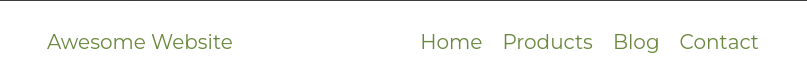
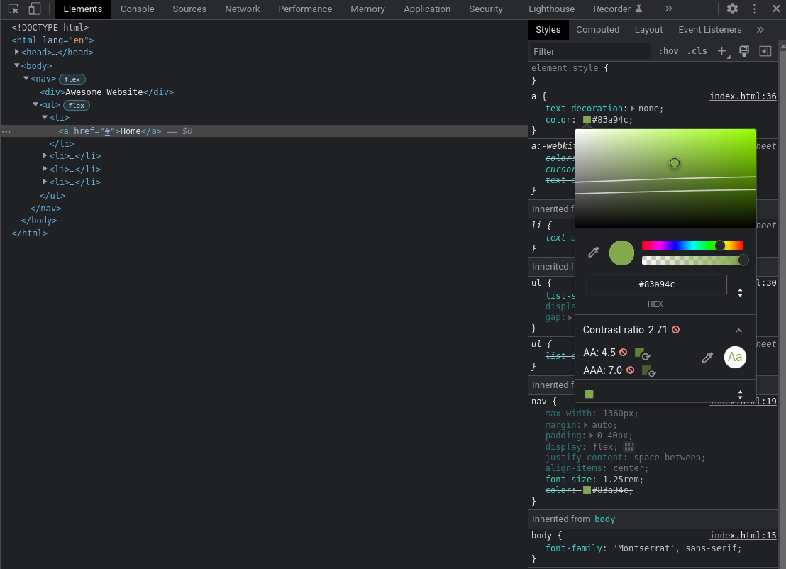
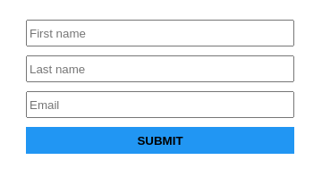
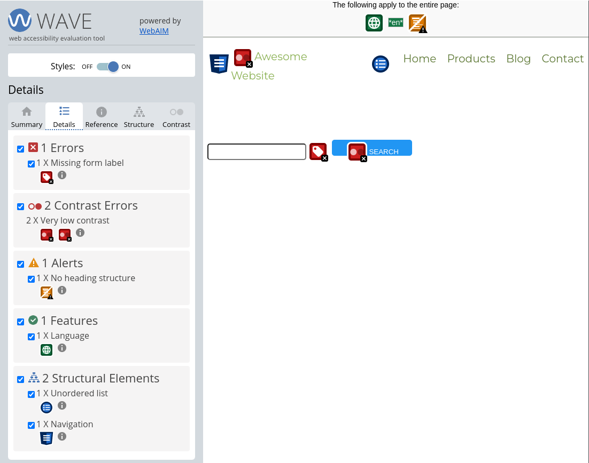
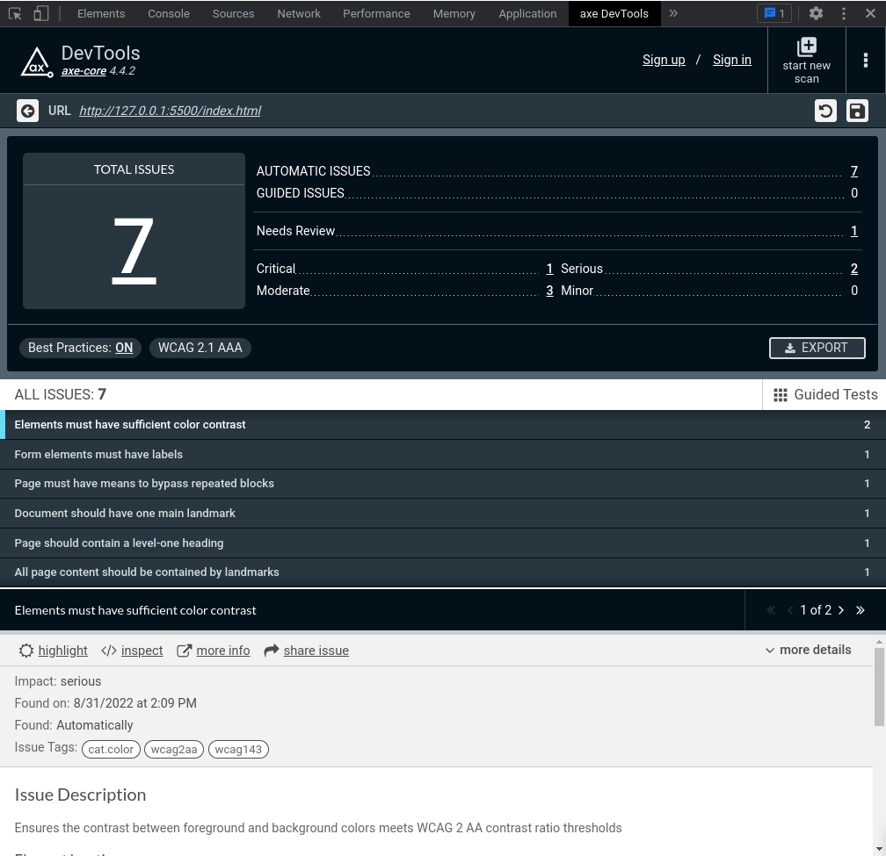

<h1>Common Web Accessibility Issues</h1>

The web is used by millions of different people everyday, one of our main goals as developers is to make the web accessible for everyone. This article will introduce some common web accessibility issues and ways to solve them.

<h2>Contrast Ratio Issue</h2>
The most common accessibility issue I've seen over the years is the contrast and color accessibility issue, a bad contrast ratio will make it hard to see the content of your page and that will be very harmful for your users, including users with visual disabilities. Contrast is a measure of the difference in perceived "luminance" or brightness between two colors, for example, it is the difference between the background color and foreground color of your page content. Let's take a look at this navbar.



Let's say your client really likes that greenish color and find it awesome, but there is an issue here, a contrast issue. We have a `#FFFFFF` background with a `#83A94C` text color resulting in a 2.71:1 contrast ratio, which is way bellow the minimum **4.5:1** needed. To detect this issue we have multiple solutions, a first solution will be to use an online contrast checker like the [Webaim Contrast Checker](https://webaim.org/resources/contrastchecker/), which will calculate the contrast ration and give you a **Pass** or **Fail** grade. A second solution is to use one of the many browser contrast checker extensions, ex: [WCAG Color contrast checker](https://chrome.google.com/webstore/detail/wcag-color-contrast-check/plnahcmalebffmaghcpcmpaciebdhgdf?hl=en). A third solution will be to use the browsers integrated contrast checker, to use it on Google Chrome, open the dev tools, inspect the targeted element (ex: Home link of our navbar), go to the CSS color property and click on the color rectangle to open the color picker, at the bottom you will be presented with a contrast ratio value, expand it for more details, the process is exactly the same for Firefox, just a small difference the ratio is shown in the bottom left of the color picker.



To get more details about contrast check this [Contrast and Color Accessibility Article](https://webaim.org/articles/contrast/).

<h2>Link Text Issue</h2>

Links make a big part of the web these days, so making them accessible is very important. A link must make sense and inform the user of its context, so an uninformative link with text like read more, click here, check details isn't very helpful so instead of doing "check details" for a product details for example, using the product name such as "The Mandalorian Helmet" is better and more informative. Words like click here or more about can be omitted because a link is clickable per default and something like "more about today's news" can be shortened to "today's news". There is no special rule or limit about link length, the link needs to be readable and long enough to give a good description about its purpose.

Images as links are a widely used pattern, so this has to follow the same rules we've talked about above, the image `alt` attribute will play the role of link text and be announced by screen readers. There are multiple case scenarios when treating images as links, if the image is the only content of the link, then it **must** have an `alt` attribute, if the link has some text and image in it then we can omit the `alt` attribute, here are some examples:

```html
<a href="/notifications">
  
</a>

<a href="/notifications">
   Notifications
</a>
```

Here are some links to read about links accessibility: [Link Text and Appearance](https://webaim.org/techniques/hypertext/link_text), [Functional Images](https://www.w3.org/WAI/tutorials/images/functional/)

<h2>Form Input Missing a Label</h2>



We've all seen these form inputs before with no label and just a placeholder to describe the purpose of the input. A first note is that as soon as the user fills all the inputs and the placeholders aren't showing anymore we will have no visual context about the inputs purpose but let us focus on the accessibility here. Associating a `label` to an input gives us two major advantages, a screen reader will read out the label when the user is focused on the form input and when a label is clicked or touched/taped the browser passes the focus to its associated input. An easy fix for this kind of situation is to just add labels as follows:

```html
<form action="/user-data" method="post">
  <div>
    <label for="firstName">First name</label>
    <input id="firstName" type="text" />
  </div>

  <div>
    <label for="lastName">Last name</label>
    <input id="lastName" type="text" />
  </div>

  <div>
    <label for="email">Email</label>
    <input id="email" type="email" />
  </div>

  <div>
    <button>Submit</button>
  </div>
</form>
```

That's it, all inputs have their associated labels making them accessible for everyone, we can even remove the placeholders to avoid duplicating the input purpose, but we all know that real world scenarios aren't so easy to deal with, you've just received a design that has these form inputs without labels and the client doesn't want to change that part. A first solution that comes to mind is to apply a `display: none;` or `visibility: hidden;` to our labels, this will hide them but they are still there right? These properties hide elements not only on the screen, but also for screen reader users, so this will not solve our problem.

We can use the **clip pattern** to solve this, we will hide the content visually, yet provide the content to screen readers. We will create the following CSS `sr-only` class and apply it on all of our labels:

```css
.sr-only:not(:focus):not(:active) {
  clip: rect(0 0 0 0);
  clip-path: inset(50%);
  height: 1px;
  overflow: hidden;
  position: absolute;
  white-space: nowrap;
  width: 1px;
}
```

This will hide our labels, make them available for screen readers and match our design. The `:not(:focus):not(:active)` pseudo-class prevents focusable elements such as `a`, `button`, `input` from being hidden when receiving focus.

<h2>No Focus Indicator</h2>

Once upon a time I did this on my global CSS stylesheet:

```css
* {
  outline: none; /* horrible mistake */
}
```

Around 2020 I noticed black borders showing up on Google Chrome form inputs when focused or on the buttons when tabbed into, that was really weird as I didn't understand it at the time, after some research I've found out that it is because of the `outline` CSS property so removing solved that "Problem" for me, but what is it the correct thing to do, I had no idea at that time. After doing some investigation about the whys and the hows of that new default I found out that `outline` is an element `focus` indicator and if removed an **obvious focus styling must be provided**, basicly what I was doing is considered a bad practice. You can customize focus indicators as you see fit, but removing it completely from the website is a big accessibility issue. Customizing an `a` element `focus` styling is fairly easy for example:

```css
a:focus {
  outline: 4px solid #ee7834;
  outline-offset: 4px;
}
```

<h2>Accessibility Tools</h2>
Checking all of the issues we've talked about can be a lot of work to do, especially knowing that there is a lot more stuff to cover about accessibility, so to help us deal with accessibility we have 2 great browser extensions.

[WAVE Evaluation Tool](https://wave.webaim.org/) is a suite of evaluation tools that helps us make our web content more accessible. It is available in both Google Chrome and Firefox. Let's try it on a small web page containing a navbar and an input missing a label and see what it returns, after installing the extension, we just need to click on the extension icon to use it.



The Summary tab shows 1 error (form element missing a label), 2 contrast errors and 1 alert (missing heading structure), as you can see the result is very clear and detailed. The Details tab will render a list of all the errors, alerts and features. We can also interact directly on the page by clicking on those red rectangles to check the error description and type.

[Axe DevTools](https://www.deque.com/axe/devtools/) is a powerful and accurate accessibility toolkit. It is available in both Google Chrome and Firefox. After installing the extension, we will need to open the browser dev tools and go to the axe DevTools tab and click Scan all of my page.



You can see Axe DevTools has reported the same issues with the WAVE Evaluation Tool which are contrast issues, form element missing a label and missing a heading element, it even gave us some best practices to follow.

An additional way to test for accessibility is to use a screen reader and test your website with it, there are many screen readers available, to name just a few:

- [NVDA](https://www.nvaccess.org/) is a free screen reader for windows.
- [VoiceOver](https://support.apple.com/guide/voiceover/welcome/mac) is available on macOs devices.
- [Orca](https://help.gnome.org/users/orca/stable/introduction.html.en) is a free and open source screen reader for linux.

<h2>Useful Links</h2>

Here are some useful links to learn more about web accessibility:

- [Web Accessibility Initiative](https://www.w3.org/WAI/), the W3C Web Accessibility Initiative (WAI) develops standards and support materials to help you understand and implement accessibility.
- [WebAIM](https://webaim.org/) is a community that has web accessibility in mind and offers a lot of quality content.
- [A11y](https://www.a11yproject.com/) is a community-driven effort to make digital accessibility easier.
- [MDN Web Docs](https://developer.mozilla.org/en-US/), you'll find in many articles an accessibility section describing some considerations to take and best practices to follow.

<h2>Summary</h2>

We've seen in this article some common web accessibility issues, ways to solve them, and some great tools to test for web accessibility. There is still a lot more to cover about accessibility for elements like Dialogs, Accordions and Carousels but as you've seen in this article there is plenty of documentation and tools to help you deal with accessibility.

Some key points to remember:

- Always check for contrast ratio
- Always provide informative content to links
- A form element must have a label associated with it
- Obvious focus styling must be provided
